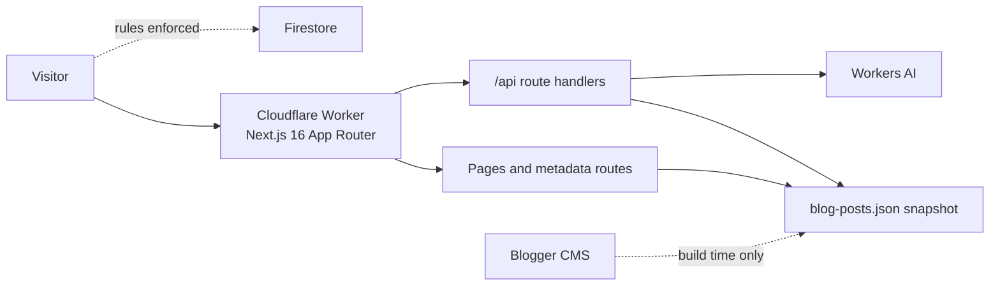

# Architecture Documentation

Design documentation for the Syed Zubair Hussain portfolio. Each document
describes what the system actually does today, including the trade-offs and the
known weak points, rather than an idealised design.

| Document | Read it for |
| --- | --- |
| [System architecture](./system-architecture.md) | Component map, request lifecycle, content pipeline, caching, build and deploy |
| [API architecture](./api-architecture.md) | Every `/api` route, its contract, fallbacks, error conventions and tests |
| [Security architecture](./security-architecture.md) | Headers and CSP, Firestore rules, signed redirects, form abuse controls, threat model |

## Quick orientation

- **One deployable unit.** UI, API routes and static assets ship as a single
  Cloudflare Worker built by OpenNext.
- **Blogger is the CMS, captured at build time.** Posts are normalized into a
  JSON snapshot, so article pages are static and no visitor request depends on
  Blogger. A scheduled workflow rebuilds when Blogger changes.
- **Server-side enforcement.** Firestore rules, schema validation and security
  headers are the real controls; client checks are user experience only.
- **Degrade, never break.** Every external dependency has a fallback path.

## Keeping these documents accurate

Update the relevant document in the same commit as the change when you:

- add or change an `/api` route (API + security),
- change caching, rendering or the content pipeline (system),
- change headers, CSP, Firestore rules or auth (security),
- add an external service (all three).

Verification evidence for the current state lives in [`records/`](../records),
and operational runbooks live in [`docs/`](../docs).
