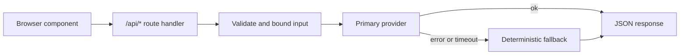
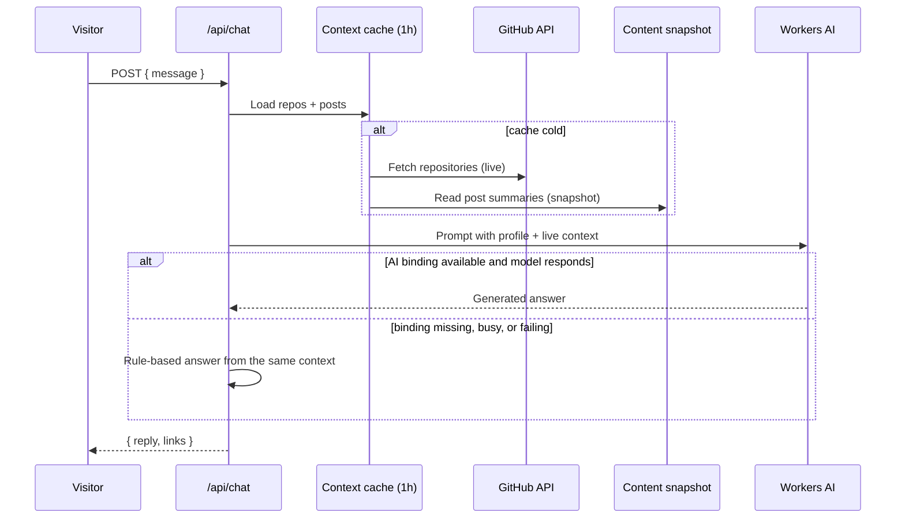
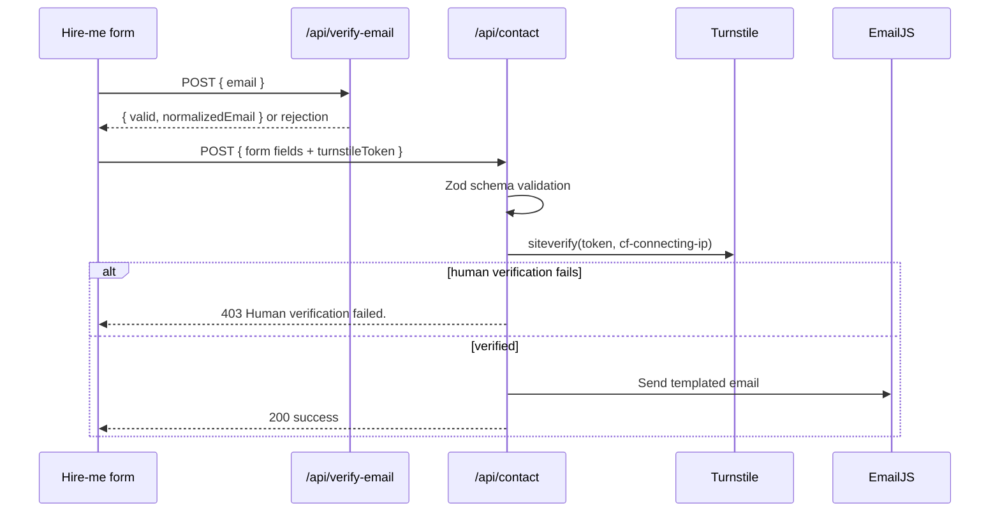
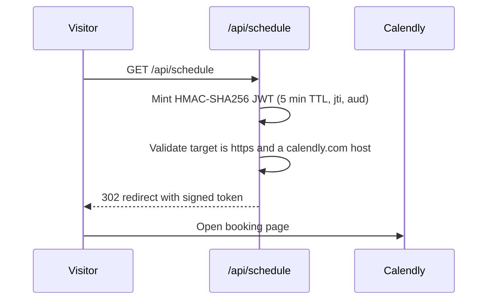

# API Architecture

Every server capability is a Next.js App Router route handler running inside
the Cloudflare Worker. There is no separate API server, no shared session
store, and no database connection pool. See also
[system architecture](./system-architecture.md) and
[security architecture](./security-architecture.md).

---

## 1. Route inventory

| Route | Method | Mode | Purpose | External dependency |
| --- | --- | --- | --- | --- |
| `/api/articles` | GET | `force-static` | Blog cards for the homepage grid | Build-time snapshot |
| `/api/chat` | POST | dynamic | "Zubair AI" assistant | Workers AI, GitHub, snapshot |
| `/api/contact` | POST | dynamic | Hire-me enquiry delivery | Turnstile, EmailJS |
| `/api/firebase-config` | GET | dynamic | Public Firebase client config | Cloudflare env |
| `/api/schedule` | GET | dynamic | Signed redirect to Calendly | Calendly |
| `/api/suggest-timeline` | POST | dynamic | Project timeline estimate | Workers AI |
| `/api/verify-email` | POST | dynamic | Email syntax and domain check | Cloudflare DNS over HTTPS |

`robots.txt` disallows `/api/`, so these endpoints are not indexed.

---

## 2. Shared design rules

1. **Secrets stay server-side.** No API key is shipped to the browser. Client
   helpers such as `src/lib/ai.ts` call our own route instead of a vendor.
2. **Always answer.** Routes that depend on an external service degrade to a
   deterministic fallback rather than failing the user interaction.
3. **Bounded input.** Request bodies are length-capped or schema-validated
   before use.
4. **Timeouts everywhere.** Outbound calls use `AbortSignal.timeout(...)` so a
   slow third party cannot hold a Worker request open.
5. **Explicit caching.** Each route states its own cache policy; nothing relies
   on default behaviour.



---

## 3. Content endpoint

### `GET /api/articles`

Returns the card-shaped payload for the homepage grid, built from the same
normalized posts used by `/blog`. The route is `force-static` with
`revalidate = false`: it reads `src/generated/blog-posts.json` and calls
`getLatestPostSummaries(HOMEPAGE_ARTICLE_LIMIT)`, currently six posts. No
Blogger request happens while serving a visitor.

```jsonc
{
  "blogHome": "https://zubair-xovato.blogspot.com/",
  "posts": [
    {
      "id": "slug",
      "slug": "slug",
      "title": "Post title",
      "excerpt": "Short teaser",
      "tags": ["Next.js"],
      "readTime": "5 min",
      "date": "Aug 28, 2026",
      "isoDate": "2026-08-28T00:00:00.000Z",
      "url": "/blog/slug",          // on-site reader
      "sourceUrl": "https://...",   // original Blogger permalink
      "trending": true
    }
  ]
}
```

Cache header: `public, max-age=0, s-maxage=1800, stale-while-revalidate=86400`.
The CDN holds a copy for 30 minutes and may serve a stale copy for a day while
revalidating. Fresh content arrives through the rebuild workflow described in
the [system architecture](./system-architecture.md#keeping-the-snapshot-fresh).

---

## 4. AI endpoints

### `POST /api/chat`

The assistant answers only from Zubair's own data: the profile in
`src/lib/zubair-profile.ts`, live GitHub repositories, and live blog posts.



The rule-based engine is not an error path bolted on afterwards; it reads the
same context object, so the assistant keeps working when the model does not.

### `POST /api/suggest-timeline`

Input: `{ category, location }`, each truncated to 120 characters. Workers AI
is asked for one short line (max 48 tokens). If the binding is missing or the
answer is empty, a deterministic estimate is returned by category — for example
mobile work returns `4-8 weeks (based on typical mobile app scope)`. The client
helper in `src/lib/ai.ts` also falls back on any network error, so the UI
always shows a timeline.

---

## 5. Form and contact endpoints

### `POST /api/contact`



The Zod schema enforces every field's shape and length before any outbound
call: name 2-80, email up to 160, location 2-120, category up to 40, details
10-2000, and a Turnstile token of up to 2048 characters. Unknown fields are
rejected by parsing.

### `POST /api/verify-email`

Three checks, cheapest first:

1. **Syntax** — RFC-shaped local and domain parts, 254-character ceiling,
   64-character local part, valid labels.
2. **Disposable domain** — blocklist of known throwaway providers.
3. **Deliverability** — DNS over HTTPS against `cloudflare-dns.com`, querying
   `MX` and falling back to `A`/`AAAA`, with a 6-second timeout.

Returns `{ valid, normalizedEmail, domain, reason }`. Both the hire-me modal
and the testimonial form call it before they accept a submission.

---

## 6. Configuration and redirect endpoints

### `GET /api/firebase-config`

Serves the public Firebase client config (identifiers that are safe in a
browser and are protected by Firestore rules, not by secrecy). Values come from
the Cloudflare environment when available, with hardcoded public-safe
fallbacks. Responds `503 { configured: false }` with `Cache-Control: no-store`
if configuration is unavailable, so the client can degrade instead of crashing.

### `GET /api/schedule`

Keeps the Calendly link out of the HTML source while still being a plain link
for the visitor.



Full claim and key details are in the
[security architecture](./security-architecture.md#5-signed-scheduling-redirect).

---

## 7. Error and status conventions

| Situation | Status | Body |
| --- | --- | --- |
| Validation failure | 400 | `{ error }` |
| Human verification failure | 403 | `{ error: "Human verification failed." }` |
| Unknown article slug | 404 | Next.js `notFound()` page |
| Configuration missing | 503 | `{ configured: false }` |
| Upstream provider unavailable | 200 | Fallback payload, never a stack trace |

Internal errors are not echoed to the client. Upstream failures are absorbed by
fallbacks so visitor-facing behaviour stays stable.

---

## 8. Test coverage

| Route or module | Test |
| --- | --- |
| `/api/articles` | `test/articles-api.test.ts` |
| `/api/contact` | `test/contact-route.test.ts` |
| `/api/schedule` | `test/schedule-route.test.ts`, `test/schedule-security.test.ts` |
| `/api/firebase-config` | `test/firebase-config.test.ts` |
| `/api/verify-email` and forms | `test/email-verification.test.ts`, `test/form-email-integration.test.ts` |
| Blog normalization | `test/blog-normalization.test.ts`, `test/blog-deduplication.test.ts` |
| Security headers | `test/next-security.test.ts` |
