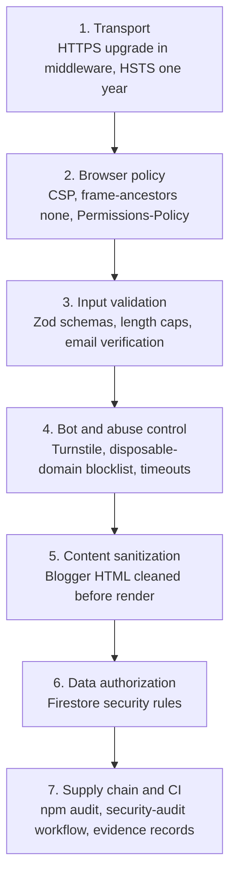
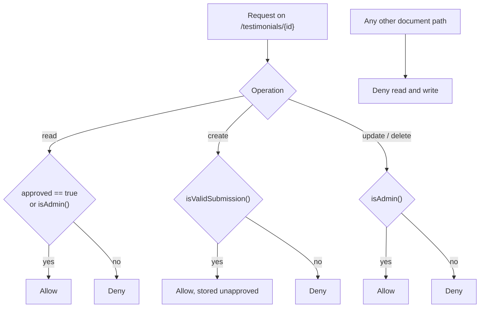
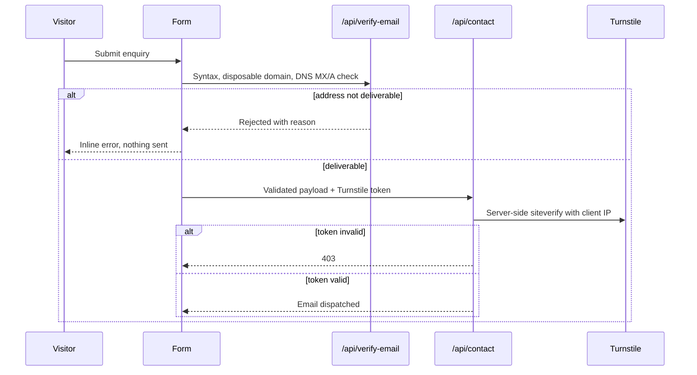

# Security Architecture

The controls that protect this site, where each one is enforced, and how it is
verified. See also [system architecture](./system-architecture.md) and
[API architecture](./api-architecture.md).

---

## 1. Principles

1. **Enforce on the server.** Client-side checks are user experience only. The
   real gates are Firestore rules, route validation, and security headers.
2. **No secret in the browser.** Vendor keys live in the Cloudflare
   environment; the browser only ever calls our own routes.
3. **Deny by default.** Firestore denies every unlisted path; CSP denies every
   unlisted origin; robots denies `/api/`.
4. **Bound every input.** Length caps and schema validation come before any
   outbound call or render.
5. **Fail safe, not open.** Missing configuration degrades the feature; it does
   not disable the check.

---

## 2. Defence layers

---

## 3. Transport and browser policy

`middleware.ts` redirects any request arriving with `x-forwarded-proto: http`
to HTTPS with a 308, before routing.

Headers are declared once in `next.config.mjs` and applied to every response:

| Header | Value | Protects against |
| --- | --- | --- |
| `Content-Security-Policy` | Allowlist per directive | Injection, untrusted third-party code |
| `Strict-Transport-Security` | `max-age=31536000; includeSubDomains` | Protocol downgrade |
| `X-Content-Type-Options` | `nosniff` | MIME confusion |
| `X-Frame-Options` | `DENY` | Clickjacking |
| `Referrer-Policy` | `strict-origin-when-cross-origin` | Referrer leakage |
| `Cross-Origin-Opener-Policy` | `same-origin-allow-popups` | Cross-window attacks |
| `Cross-Origin-Resource-Policy` | `same-site` | Cross-origin resource theft |
| `X-Permitted-Cross-Domain-Policies` | `none` | Legacy plugin policy abuse |
| `Permissions-Policy` | camera, microphone, geolocation, payment, usb, interest-cohort disabled | Unwanted device and tracking access |

CSP notes:

- `default-src 'self'`, `object-src 'none'`, `frame-ancestors 'none'`,
  `base-uri 'self'`, `form-action 'self'`, and `upgrade-insecure-requests`.
- `connect-src` is an explicit allowlist: GitHub, Blogger, Calendly, Firebase,
  EmailJS, Turnstile, and analytics. Anything else is blocked.
- `script-src` still permits `'unsafe-inline'` and `'unsafe-eval'`, required by
  the current analytics and tag-manager setup. **This is the weakest point of
  the policy** and is the natural next hardening step: move to nonces or
  hashes and drop both allowances.

`test/next-security.test.ts` asserts these headers so a regression fails CI.

---

## 4. Data authorization: Firestore rules

Testimonials are the only user-writable data. The admin check in the UI is
convenience; `firestore.rules` is the enforcement.

`isValidSubmission()` requires `approved == false`, a rating between 1 and 5,
bounded string lengths (name 80, text 1000, role 80, email 160, avatar 8), a
timestamp, and `hasOnly([...])` so unexpected fields are rejected. `isAdmin()`
requires an authenticated Firebase identity with a verified email matching the
owner.

Consequences worth stating plainly: a visitor can submit a review but cannot
publish one, cannot read unapproved reviews, and cannot edit or delete
anything. Rules are deployed separately with
`firebase deploy --only firestore:rules`.

---

## 5. Signed scheduling redirect

`/api/schedule` mints a short-lived token instead of exposing the booking URL
in the page source.

| Property | Value |
| --- | --- |
| Algorithm | HMAC-SHA256 via Web Crypto |
| Claims | `aud: calendly-schedule`, `iss: zubair-portfolio`, `sub: schedule-call`, `jti`, `iat`, `exp` |
| Lifetime | 300 seconds |
| Minimum key length | 32 characters, enforced in code |
| Target validation | Must be `https:` and a `calendly.com` host, else the known-good profile URL is used |

Key resolution order: `SCHEDULE_JWT_SECRET`, then a development-only constant,
then a deterministic key derived from public profile fields. The fallback is a
deliberate, documented trade-off: it signs a redirect to a public booking page,
not access to private data. Set `SCHEDULE_JWT_SECRET` in Cloudflare for a real
secret. Covered by `test/schedule-security.test.ts`.

---

## 6. Form abuse controls

Layers: Zod schema validation, Cloudflare Turnstile verified **server-side**
(a client-side widget alone proves nothing), a disposable-domain blocklist, DNS
deliverability checks, and 6-second timeouts on every outbound request.

---

## 7. Content sanitization

Blog bodies are authored by the owner but still treated as untrusted before
rendering with `dangerouslySetInnerHTML`. Sanitization runs at build time, so
nothing script-like is even stored in `src/generated/blog-posts.json`.
`sanitizeHtml` in `src/lib/blog.ts`
removes comments, doctypes, `<head>`, `<script>`, `<style>`, `<link>`, `<meta>`,
`<base>`, `<title>`, `srcdoc` iframes, every `on*` inline handler, and rewrites
`javascript:` URLs. `enhanceContent` then forces `rel="noopener noreferrer"`
and `target="_blank"` on outbound links. JSON-LD is serialized with `<` escaped
so injected markup cannot break out of the script tag.

---

## 8. Secrets and configuration

| Secret | Used by | Storage |
| --- | --- | --- |
| `TURNSTILE_SECRET_KEY` | `/api/contact` | Cloudflare env |
| `EMAILJS_*` | `/api/contact` | Cloudflare env |
| `SCHEDULE_JWT_SECRET` | `/api/schedule` | Cloudflare env |
| `BLOGGER_API_KEY` | `src/lib/blog.ts` | Cloudflare env |
| `GOOGLE_SEARCH_CONSOLE_CREDENTIALS` | Indexing audit workflow | GitHub secrets |
| `AUDIT_EMAIL_USERNAME` / `AUDIT_EMAIL_PASSWORD` / `AUDIT_EMAIL_TO` | Blog readiness email | GitHub secrets |

`wrangler.toml` sets `keep_vars = true` so a deploy never wipes dashboard
variables. Public Firebase identifiers are intentionally public and are
protected by Firestore rules.

A historical note preserved in the code: an earlier version exposed a Hugging
Face key through a `NEXT_PUBLIC_` variable. It was removed and replaced by the
server-side `/api/suggest-timeline` route. `NEXT_PUBLIC_` means "shipped to
every visitor" and must never hold a credential.

---

## 9. Supply chain and continuous verification

| Control | Where | Cadence |
| --- | --- | --- |
| `npm audit` on production dependencies | `records:generate`, security workflow | Every run |
| Dependency licence inventory | `records/licenses` | Every records run |
| Lint, type-check, tests, build | GitHub Actions | Every push and pull request |
| Security audit workflow | `.github/workflows/security-audit.yml` | Scheduled and on demand |
| Production audit and Lighthouse | `.github/scripts/audit-production.mjs` | Scheduled |
| Indexing and blog-readiness audits | `.github/workflows/*indexing*`, `*sitemap-submit*` | Monthly and hourly |
| Cloudflare security-audit snapshot | `docs/cloudflare-security-audit-2026-09-25.md` | Point-in-time review |

The evidence package in `records/` stores raw logs rather than summary claims,
including the non-MIT dependency licences, so the record can be checked rather
than trusted.

---

## 10. Threat model

| Threat | Control | Residual risk |
| --- | --- | --- |
| XSS through blog content | Sanitizer, CSP, escaped JSON-LD | `'unsafe-inline'` in `script-src` weakens CSP |
| Clickjacking | `X-Frame-Options: DENY`, `frame-ancestors 'none'` | Low |
| Spam and bot submissions | Turnstile, email verification, blocklist | Determined attackers can still solve challenges |
| Unauthorized review publishing | Firestore rules, admin identity check | Depends on rules being deployed |
| Credential exposure | Server-only routes, no `NEXT_PUBLIC_` secrets | Requires review discipline on new code |
| Third-party outage or abuse | Timeouts, fallbacks, caching | Degraded answers during outages |
| Dependency vulnerability | Audits and recorded evidence | Window between disclosure and update |
| Protocol downgrade | HTTPS redirect, HSTS | Low |

---

## 11. Hardening backlog

1. Replace `'unsafe-inline'` and `'unsafe-eval'` in `script-src` with nonces or
   hashes.
2. Set `SCHEDULE_JWT_SECRET` in Cloudflare so the derived fallback key is never
   used in production.
3. Add rate limiting to `/api/contact` and `/api/chat` at the Cloudflare edge.
4. Add Subresource Integrity to any third-party script that supports it.
5. Re-check `typescript.ignoreBuildErrors` in `next.config.mjs`; type errors
   currently do not block a production build.
