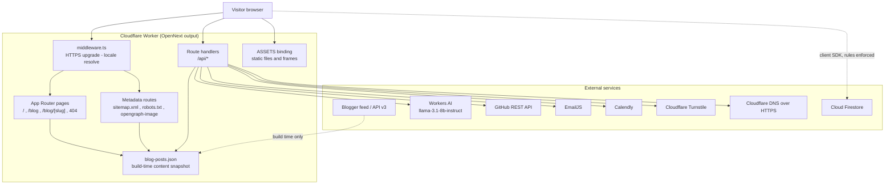
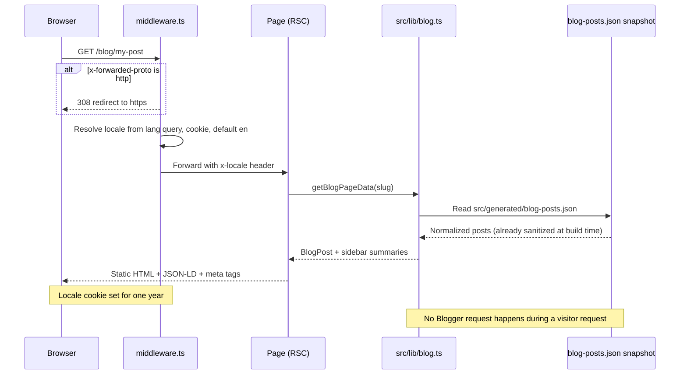
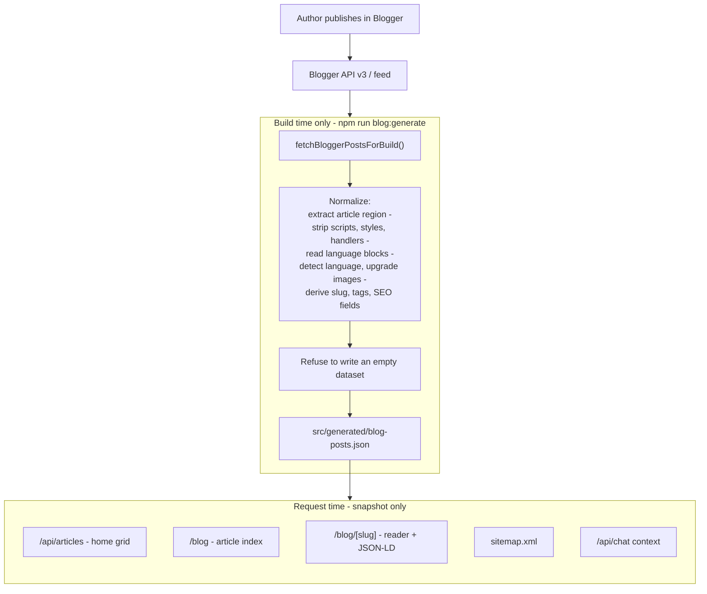
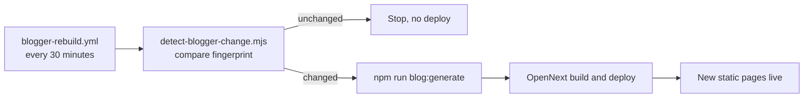
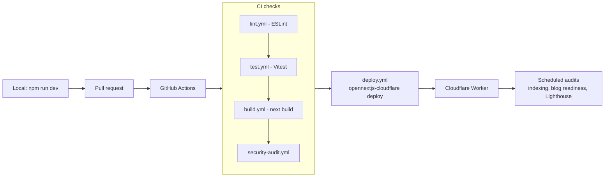

# System Architecture

How the portfolio is built, rendered, and delivered. Companion documents:
[API architecture](./api-architecture.md) and
[security architecture](./security-architecture.md).

---

## 1. Overview

The site is a single Next.js 16 App Router application compiled for the
Cloudflare Workers runtime by OpenNext. There is no separate backend: every
dynamic capability runs as a route handler inside the same Worker, next to the
static assets.

| Layer | Technology | Where it lives |
| --- | --- | --- |
| UI | React 19 server + client components | `src/app`, `src/components` |
| Styling | Tailwind CSS, `globals.css` | `src/styles` |
| Motion | Framer Motion, Lenis, canvas frame sequence | `src/components/3d`, `src/components/ui` |
| i18n | `next-intl`, six locales | `src/i18n`, `middleware.ts` |
| Server logic | Route handlers | `src/app/api/*/route.ts` |
| Shared logic | Framework-free modules | `src/lib` |
| Content | Blogger, captured at build time into a JSON snapshot | `src/lib/blog.ts`, `src/generated/blog-posts.json` |
| Community data | Cloud Firestore | `src/lib/firebase*.ts`, `firestore.rules` |
| Inference | Cloudflare Workers AI | `AI` binding in `wrangler.toml` |
| Hosting | Cloudflare Workers | `open-next.config.ts`, `wrangler.toml` |

---

## 2. Component map



---

## 3. Request lifecycle

Every HTML request passes through `middleware.ts` before a page renders.



The middleware matcher excludes `api`, `_next`, and any path containing a file
extension, so API routes, build output, and static files bypass it entirely.

---

## 4. Content pipeline

Blogger is the CMS, but **visitors never wait on Blogger**. Posts are fetched,
normalized and frozen into `src/generated/blog-posts.json` at build time. Pages
read that snapshot, so article pages are fully static.



Key properties:

- **Static at request time.** `/blog`, `/blog/[slug]`, `sitemap.xml` and
  `/api/articles` are `force-static` with `revalidate = false`. A Blogger
  outage cannot affect a visitor.
- **One source of truth.** Every surface reads the same normalized `BlogPost`
  shape from `src/lib/blog.ts`.
- **Build hooks.** `predev` and `prebuild` run `blog:generate`, so local and
  production builds always carry a current snapshot.
- **Empty-dataset guard.** If Blogger returns nothing, generation throws rather
  than replacing good content with an empty file.
- **Paged fetching.** The feed is paged in batches of 25 up to a 600-post cap,
  so post count is never silently truncated.
- **Sanitized at build.** Post bodies pass through `sanitizeHtml` before they
  reach the snapshot, so nothing script-like is stored or rendered.
- **Multilingual.** A post can carry portfolio-only translated variants which
  become sibling pages linked by `hreflang`.

### Keeping the snapshot fresh



Publishing still needs no code change: the scheduled workflow notices the
change and redeploys. The trade-off is that a new post appears after the next
rebuild rather than instantly.

---

## 5. Rendering and caching

| Surface | Strategy | Refreshed by |
| --- | --- | --- |
| `/` | Server render, lazy sections below the fold | Deploy |
| `/blog`, `/blog/[slug]` | `force-static`, `revalidate = false` | Rebuild workflow |
| `sitemap.xml`, `robots.txt`, `opengraph-image` | Static | Deploy |
| `/api/articles` | `force-static` plus CDN headers (`s-maxage=1800`, `stale-while-revalidate=86400`) | Deploy and CDN |
| `/api/chat` context | Live GitHub data cached in the Worker | 3600 s |
| `/api/contact`, `/api/verify-email`, `/api/schedule`, `/api/suggest-timeline`, `/api/firebase-config` | `force-dynamic` | Every request |

Front-end weight is controlled by lazy loading: homepage sections below the
hero use `React.lazy` with Suspense fallbacks, and client-only widgets
(cursor, chatbox, WhatsApp button, scroll progress) load through
`DeferredClientTools` after first paint. Analytics scripts use
`strategy="lazyOnload"`.

---

## 6. Avatar frame-sequence animation

The hero avatar is a scroll-linked image sequence rather than a downloaded 3D
model: 197 JPEG frames in `public/frames` are drawn to a canvas and advanced by
scroll position. This keeps the interaction smooth on mobile without shipping a
large GLB.


Regenerate the documentation animation with:

```bash
npm run docs:animation
```

`test/avatar-sequence-perf.test.ts` guards the loading behaviour.

---

## 7. Build and deploy pipeline

`predev` and `prebuild` run `npm run blog:generate` first, so the content
snapshot is refreshed before any dev server or production build starts.



Local equivalents: `npm run lint`, `npm run test`, `npm run type-check`,
`npm run build`, and `npm run records:generate` for the full evidence package
in `records/`.

---

## 8. Directory map

```text
src/
  app/
    api/            Route handlers (see API architecture)
    blog/           Article index and reader
    layout.tsx      Root metadata, JSON-LD graph, analytics, fonts
    sitemap.ts      Blog-aware sitemap
    robots.ts       Crawl rules
  components/
    3d/             Avatar sequence, globe, hero 3D
    sections/       Page sections (hero, projects, articles, testimonials)
    ui/             Navigation, modals, chatbox, providers
  lib/              Framework-free logic: blog, seo, email, firebase, security
  generated/        blog-posts.json, written by npm run blog:generate
  i18n/             next-intl request configuration
  styles/           Tailwind layers and blog content styles
architecture/       This documentation set
docs/               Operational runbooks and documentation assets
records/            Generated verification evidence
test/               Vitest suites
```

---

## 9. Design decisions

| Decision | Reason | Trade-off |
| --- | --- | --- |
| Blogger as CMS | Authoring needs no database and no code change | Depends on an external feed; mitigated by the build-time snapshot |
| Build-time snapshot over request-time fetch | Static pages, no visitor-facing Blogger dependency | New posts appear only after the next rebuild |
| Single Worker for UI and API | One deploy, no cold backend, low latency | Route handlers must stay edge-compatible |
| Frame sequence over GLB | Faster first paint on mobile | Many small image assets in the repo |
| Normalization in `src/lib/blog.ts` | Every surface stays consistent | One module carries most parsing complexity |
| Firestore rules as the real gate | Client-side checks can be bypassed | Rules must be deployed separately |
